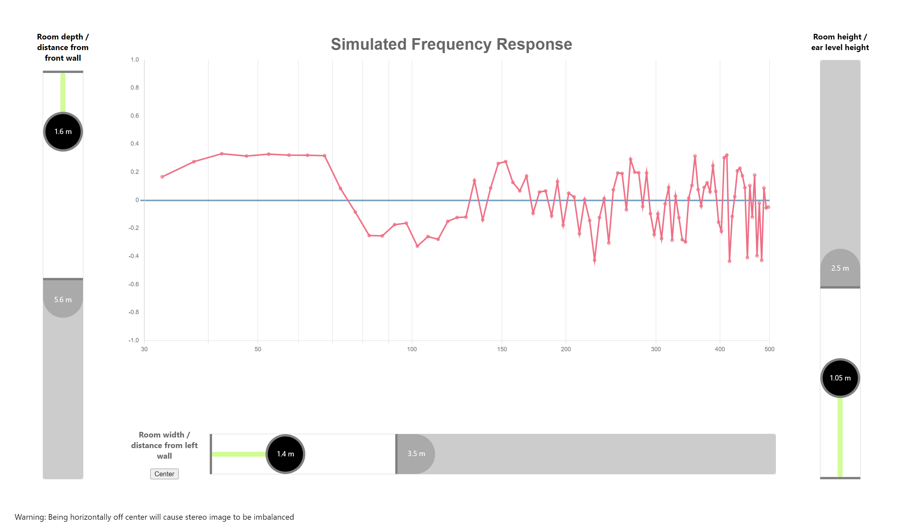

# Room Acoustics Simulator

This app simulates standing waves to predict a frequency response when listening in certain location of your room. This could be used as a starting point to find a suitable listening spot.

Note that the simulation is somewhat simplistic and its correctness is questionable. Remember also that the frequency response is only one aspect of room acoustics.

